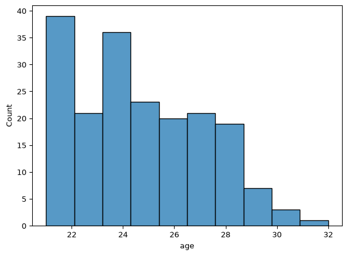
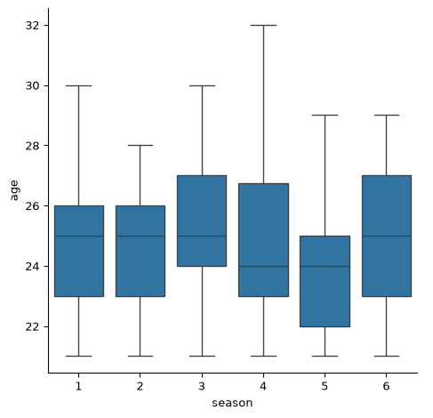
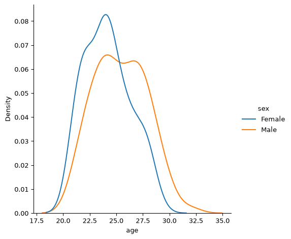
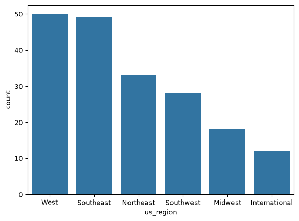
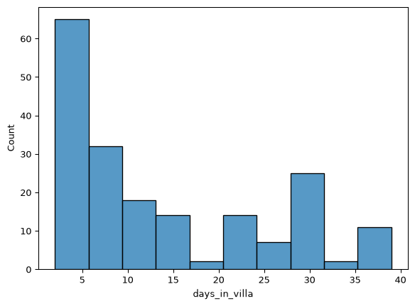
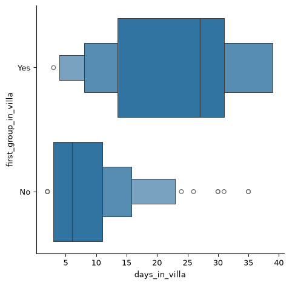

# Final Project: Exploring Love Island USA Data


# Background Information & Data Preparation

For my final project, I found a data set containing information on past
Love Island USA contestants, aka ‘islanders’, from seasons 1-6. Love
Island is a reality TV show where single people live in a villa in Fiji
all summer while searching for love. While one group enters the villa on
day 1, several more people are introduced into the mix as ‘bombshells’
throughout the season. In order to remain in the villa, islanders must
be coupled up with a partner or they will be dumped. Each season ends
with America voting for their favorite remainning couple as the winners.

Loading the packages I am going to use:

``` python
import pandas as pd
import numpy as np
import seaborn as sns
import matplotlib.pyplot as plt
```

My data is a csv file that I downloaded from GitHub. Importing my data:

``` python
love_island_df = pd.read_csv('C:/Users/Parri Salak/OneDrive/Documents/MSBA/Python/LoveIslandUSA.csv')
```

Cleaning column names to be in snake case:

``` python
love_island_df.columns
love_island_df.columns = love_island_df.columns.str.strip().str.replace(' ', '_')
love_island_df.columns = love_island_df.columns.str.lower()
love_island_df.columns
```

    Index(['season', 'sex', 'first_name', 'last_name', 'age', 'occupation',
           'result', 'first_group_in_villa',
           'have_they_appeared_on_a_previous_season_of_li_usa?',
           'day_entered_villa', 'day_left_villa', 'days_in_villa', 'location',
           'us_region', 'birthday', 'zodiac', 'casa_amor_contestant',
           'casa_decision'],
          dtype='str')

# Data Exploration

Looking at the first 5 rows of data:

``` python
love_island_df.head()
```

<div>
<style scoped>
    .dataframe tbody tr th:only-of-type {
        vertical-align: middle;
    }
&#10;    .dataframe tbody tr th {
        vertical-align: top;
    }
&#10;    .dataframe thead th {
        text-align: right;
    }
</style>

|  | season | sex | first_name | last_name | age | occupation | result | first_group_in_villa | have_they_appeared_on_a_previous_season_of_li_usa? | day_entered_villa | day_left_villa | days_in_villa | location | us_region | birthday | zodiac | casa_amor_contestant | casa_decision |
|----|----|----|----|----|----|----|----|----|----|----|----|----|----|----|----|----|----|----|
| 0 | 1 | Female | Elizabeth | Weber | 24 | Advertising executive | Winner | Yes | No | 1 | 27 | 26 | New York, New York | Northeast | 8-Sep-94 | Virgo | No Casa this season | No Casa this season |
| 1 | 1 | Male | Zac | Mirabelli | 22 | Grocery store cashier | Winner | Yes | No | 1 | 27 | 26 | Chicago, Illinois | Midwest | 18-Sep-96 | Virgo | No Casa this season | No Casa this season |
| 2 | 1 | Female | Alexandra | Stewart | 25 | Publicist | Runner-Up | Yes | No | 1 | 27 | 26 | Los Angeles, California | West | 4-Jun-94 | Gemini | No Casa this season | No Casa this season |
| 3 | 1 | Male | Dylan | Curry | 25 | Personal trainer | Runner-Up | No | No | 4 | 27 | 23 | San Diego, California | West | 3-Feb-94 | Aquarius | No Casa this season | No Casa this season |
| 4 | 1 | Female | Caro | Viehweg | 21 | Student | 3rd Place | Yes | No | 1 | 27 | 26 | Los Angeles, California | West | 26-Dec-97 | Capricorn | No Casa this season | No Casa this season |

</div>

The data contains 190 rows, and 18 columns:

``` python
love_island_df.shape
```

    (190, 18)

What types of information does the data contain:

``` python
love_island_df.info()
```

    <class 'pandas.DataFrame'>
    RangeIndex: 190 entries, 0 to 189
    Data columns (total 18 columns):
     #   Column                                              Non-Null Count  Dtype
    ---  ------                                              --------------  -----
     0   season                                              190 non-null    int64
     1   sex                                                 190 non-null    str  
     2   first_name                                          190 non-null    str  
     3   last_name                                           190 non-null    str  
     4   age                                                 190 non-null    int64
     5   occupation                                          185 non-null    str  
     6   result                                              190 non-null    str  
     7   first_group_in_villa                                190 non-null    str  
     8   have_they_appeared_on_a_previous_season_of_li_usa?  190 non-null    str  
     9   day_entered_villa                                   190 non-null    int64
     10  day_left_villa                                      190 non-null    int64
     11  days_in_villa                                       190 non-null    int64
     12  location                                            190 non-null    str  
     13  us_region                                           190 non-null    str  
     14  birthday                                            164 non-null    str  
     15  zodiac                                              164 non-null    str  
     16  casa_amor_contestant                                190 non-null    str  
     17  casa_decision                                       82 non-null     str  
    dtypes: int64(5), str(13)
    memory usage: 26.8 KB

## Age

One variable I would like to further explore is age. Most islanders that
appear on the show are in their 20s, but what is their average age? Does
this change across different groups, such as season, gender, or result?

The oldest islander was 32 years old at the time of their appearance on
Love Island. This islander was Felipe Gomes:

``` python
love_island_df['age'].max()
```

    np.int64(32)

``` python
oldest_islander = love_island_df[love_island_df['age'] == love_island_df['age'].max()]
oldest_islander['first_name'] + ' ' + oldest_islander['last_name']
```

    121    Felipe Gomes
    dtype: str

The average age of contestants on Love Island is ~25 years old. However,
the data also appear to be skewed right so median would be a better
measure of center for this distribution:

``` python
love_island_df['age'].mean()
```

    np.float64(24.789473684210527)

``` python
sns.histplot(data=love_island_df, x='age', bins=10)
plt.show()
```



The median age of islanders in 24. This is less than the mean, and is
consistant with what I expected due to the right skew of the
distribution:

``` python
love_island_df['age'].median()
```

    np.float64(24.0)

Average age seems to have remained consistant across seasons, with
season 3 having the highest average age and season 5 having the lowest:

``` python
love_island_df.groupby('season')['age'].mean()
```

    season
    1    24.680000
    2    24.677419
    3    25.411765
    4    24.676471
    5    24.151515
    6    25.090909
    Name: age, dtype: float64

``` python
sns.catplot(data=love_island_df, x="season", y="age", kind='box')
plt.show()
```



Female islanders have a slightly lower average age (24) then male
islanders (25):

``` python
love_island_df.groupby('sex')['age'].mean()
```

    sex
    Female    24.170213
    Male      25.395833
    Name: age, dtype: float64

``` python
sns.displot(data=love_island_df, x='age', hue='sex',kind="kde")
plt.show()
```



The average age of winners does not differ from the overall average age
of contestants:

``` python
# Looking at winner as one result vs each other possible outcome
love_island_df.groupby('result')['age'].mean()
```

    result
    3rd Place    24.916667
    4th Place    24.900000
    Dumped       24.906250
    Removed      24.000000
    Runner-Up    23.500000
    Walked       24.428571
    Winner       25.166667
    Name: age, dtype: float64

``` python
# Looking at islanders being either a winner or loser
love_island_df['is_winner'] = love_island_df['result'].apply(lambda x: True if x == 'Winner' else False)

love_island_df.groupby('is_winner')['age'].mean()
```

    is_winner
    False    24.764045
    True     25.166667
    Name: age, dtype: float64

## Location

Another variable I would like to explore is location. This is the city
that each islander is currently living in before appearing on Love
Island.

There are 127 different locations where islanders come from:

``` python
love_island_df['location'].nunique()
```

    127

The most common city for islanders to be living in is Los Angeles,
California with 16 contestants. This is most likely because producers
host in-person recruiting for the show in LA:

``` python
love_island_df['location'].value_counts().sort_values(ascending=False)
```

    location
    Los Angeles, California          16
    Miami, Florida                   10
    Houston, Texas                   10
    New York, New York                5
    Dallas, Texas                     5
                                     ..
    Athens, Georgia                   1
    Medellín, Colombia                1
    Hagerstown, Indiana               1
    Santa Monica, California          1
    Winston-Salem, North Carolina     1
    Name: count, Length: 127, dtype: int64

The data also contains a variable for the region of the United States
that each contestant comes from:

``` python
love_island_df['us_region'].value_counts()
```

    us_region
    West             50
    Southeast        49
    Northeast        33
    Southwest        28
    Midwest          18
    International    12
    Name: count, dtype: int64

``` python
sns.countplot(love_island_df, x='us_region', order=love_island_df['us_region'].value_counts().index)
```



## Days in Villa

As more contestants enter the villa, islanders are forced to leave. I
want to look at the minimum, maximum, and average amount of time spent
in the villa.

The longest time spent in the villa was 39 days, and the shortest was
only 2 days. The average time in the villa is around 14 days, or two
weeks:

``` python
love_island_df['days_in_villa'].describe()
```

    count    190.000000
    mean      14.073684
    std       11.598433
    min        2.000000
    25%        4.000000
    50%        9.000000
    75%       23.750000
    max       39.000000
    Name: days_in_villa, dtype: float64

``` python
sns.histplot(data=love_island_df, x='days_in_villa', bins=10)
plt.show()
```



How does being in the first group in the villa change this? While the
minimum and maxium do remain fairly consistant, the average amount of
time spent in the villa for day 1 (‘original’) islanders is much higher
at almost 24 days:

``` python
love_island_df[love_island_df['first_group_in_villa'] == 'Yes']['days_in_villa'].describe()
```

    count    67.000000
    mean     23.895522
    std      11.439080
    min       3.000000
    25%      13.500000
    50%      27.000000
    75%      31.000000
    max      39.000000
    Name: days_in_villa, dtype: float64

``` python
sns.catplot(love_island_df, x='days_in_villa', y='first_group_in_villa', kind='boxen')
plt.show()
```



## Conclusion

For this project, I explored historical Love Island USA data to answer
question about islander’s age, location, and time spent in the villa. To
summerize, although the average age of female contestants is slightly
younger than male, age remains consistant at ~25 years old across
seasons and results. Most contestants come from the West coast of USA,
and more specifically Los Angeles, CA. The average amount of time spent
in the villa is two weeks, however those who were part of the original
group of islanders each season were in the villa for much longer.
